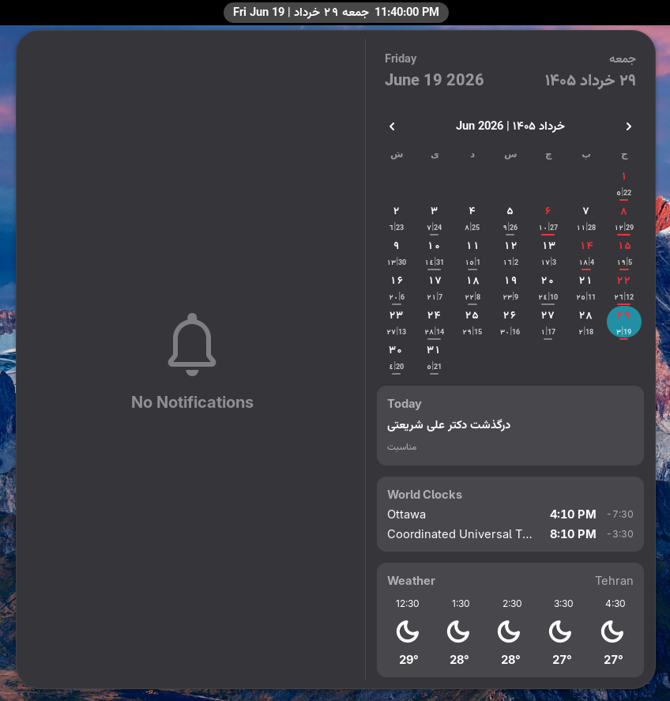

# GNOME Jalali Calendar
[](https://extensions.gnome.org/)
[](https://github.com/mohammadv184/gnome-jalali-calendar/blob/main/LICENSE)
---
A calendar extension for GNOME Shell.





## Installation

### Method 1: Using Make (Recommended)

1. Clone this repository:
```bash
git clone https://github.com/mohammadv184/gnome-jalali-calendar.git
cd gnome-jalali-calendar
```

2. Run the install command:
```bash
make install
```

3. Restart GNOME Shell (Press `Alt+F2`, type `r`, and hit `Enter`, or log out and log back in on Wayland).
4. Enable the extension using the "Extensions" app.

### Method 2: Manual Installation

Copy the repository files manually to the extensions folder:
```bash
mkdir -p ~/.local/share/gnome-shell/extensions/jalali-calendar@mohammad-abbasi.me
cp -r * ~/.local/share/gnome-shell/extensions/jalali-calendar@mohammad-abbasi.me/
glib-compile-schemas ~/.local/share/gnome-shell/extensions/jalali-calendar@mohammad-abbasi.me/schemas/
```
Then restart GNOME Shell and enable it.

